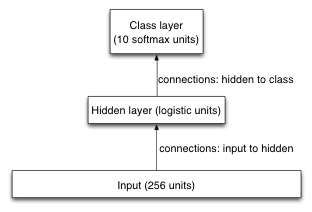

## Programming assignment 3: Optimization and generalization

In this assignment, you're going to train a simple Neural Network, for recognizing handwritten digits. You'll be programming, looking into efficient optimization, and looking into effective regularization.

The dataset for this assignment is the USPS collection of handwritten digits. It consists of scans (images) of digits that people wrote. The input is a 16 by 16 image of greyscale pixels, showing an image of a handwritten digit. The output is simply which of the 10 different digits it is, so we're using a 10-way softmax as the output layer of our Neural Network. The input layer is simply 256 units, i.e. one for each pixel. We use one hidden layer of logistic units. One of the issues we'll be investigating is what number of hidden units works best for generalization. To keep things as simple as possible, we're not including biases in our model. In the diagram you can see that this model is significantly simpler than the model that we used in programming assignment 2.

In this assignment, we're mostly interested in the cross-entropy error, as opposed to the classification error rate. The reason for that is that the cross-entropy error is continuous and behaves better than the classification error rate. Only at the very end will we look at the classification error rate.To investigate generalization, we need a training set, a validation set, and a test set, so the dataset has been split in 3 groups. We train our networks on the training set; we use the validation set to find out what's generalizing well and what isn't; and after we've made our choice of regularization strategy, we'll see how well our model performs on the test set. Those three subsets have already been made for you, and you're not expected to change them (you're not even allowed to change them). The full USPS dataset has 11,000 images. We're using 1,000 of them as training data, another 1,000 as validation data, and the remaining 9,000 as test data. Normally, one would use most of the data as training data, but for this assignment we'll use less, so that our programs run more quickly.Before we get to the issue of generalization, we need a good optimization strategy. The optimizer that we're using is gradient descent with momentum, but we'll need to find good values for the learning rate and the momentum multiplier.

### Part 1: Setting up

We're using Octave. You probably already have that working well, because you also needed it for assignment 2. Download the code from here, and the data from here. Make sure that the code file is called "a3.m" and the data file is called "data.mat". Place both of them in the same directory, start Octave, cd to that directory, and run a test run without any training: `a3(0, 0, 0, 0, 0, false, 0)`. You should see messages that tell you the loss and classification error rate without any training.

#### Question 2
What is the loss on the training data for that test run? Write your answer with at least 5 digits after the decimal point.

Answer: 2.302585

### Part 2: Programming
Most of the code has already been written for you. The script in a3.m loads the data (training, validation, and test), performs the optimization, and reports the results, including some numbers and a plot of the training data and validation data loss as training progresses. For the optimization it needs to be able to compute the gradient of the loss function, and that part is up to you to implement, in function d_loss_by_d_model. You're not allowed to change any other part of the code. However, you should take a quick look at it, and in particular you should make sure that you understand the meaning of the various parameters that the main script takes (see line 1 of a3.m).

The program checks your gradient computation for you, using a finite difference approximation to the gradient. If that finite difference approximation results in an approximate gradient that's very different from what your gradient computation procedure produced, then the program prints an error message. This is hugely helpful debugging information. Imagine that you have the gradient computation done wrong, but you don't have such a sanity check: your optimization would probably fail in many weird and wonderful ways, and you'd be worrying that perhaps you picked a bad learning rate or so. (In fact, that's exactly what happened to me when I was preparing this assignment, before I had the gradient checker working.) With a finite difference gradient checker, at least you'll know that you probably got the gradient right. It's all approximate, so the checker can never know for sure that you did it right, but if your gradient computation is seriously wrong, the checker will probably notice.

Take a good look at the loss computation, and make sure that you understand it.

* Notice that there's classification loss and weight decay loss, which are added together to make the loss.
* Also notice that the loss function is an average over training cases, as opposed to a sum. Of course, that affects the gradient as well.

Now take a pen & paper, figure out how to compute the gradient, and implement it in Octave.

Here are some step-by-step suggestions, but you don't need to use them, as long as you get that gradient computation right.

* After you figured out the math on paper, start with the weight decay loss, and do a run with huge weight decay, so that the weight decay loss overshadows the classification loss. Run a3(1e7, 7, 10, 0, 0, false, 4), i.e. 7 hidden units. If the gradient check passes, then you probably did this right. If it doesn't, take a close look at the error message, and try to figure out where you may have made a mistake.
* After you have the weight decay loss gradient working, turn off weight decay, i.e. go to a3(0, 7, 10, 0, 0, false, 4), and you'll see the gradient error message coming back.
* Then implement the classification loss gradient, and if you get any error message from the gradient checker, look closely at the numbers in that error message. When you have a correct implementation, proceed to the next part.

### Part 3: Optimization

We'll start with a small version of the task, to best see the effect of the optimization parameters. The small version is that we don't use weight decay or early stopping, we use only 10 hidden units, 70 optimization iterations, and mini-batches of size 4 (usually, mini-batch size is more like 100, but for now we use 4).

While we're investigating how the optimization works best, we'll only look at the loss on training data. That's what we're directly optimizing, so if that gets low, then the optimizer did a good job, regardless whether the solution generalizes well to the validation data.

Let's do an initial run with with learning rate 0.005 and no momentum: run a3(0, 10, 70, 0.005, 0, false, 4)

#### Question 3
What is the training data loss that that run reports at the end? Use at least 5 digits after the decimal point.

Answer: 2.303441

#### Question 4 & 5

In the plot you'll see that training data loss and validation data loss are both decreasing, but they're still going down steadily after those 70 optimization iterations. We could run it longer, but for now we won't. We'll see what we can do with 70 iterations. If we would run our optimization for an hour (i.e. many iterations), then when we get a bigger task and bigger network, the program might take a lot longer than an hour to do the same number of optimization iterations.

Let's try a bigger learning rate: LR=0.5, and still no momentum. You'll see that this works better.

Finding a good learning rate is important, but using momentum well can also make things work better. Without momentum, we simply add ϵ⋅−∂E∂θ to θ at every iteration, but with momentum, we use a more sophisticated strategy: we keep track of the momentum speed, using vt+1=vt⋅λ−∂E∂θ, and then we add v⋅ϵ to θ. That λ can be anything between 0 and 1, but usually 0.9 works well.

Let's try a variety of learning rates, to find out which works best. We'll try 0.002, 0.01, 0.05, 0.2, 1.0, 5.0, and 20.0. We'll try all of those both without momentum (i.e. momentum=0.0 in the program) and with momentum (i.e. momentum=0.9 in the program), so we have a total of 7 x 2 = 14 experiments to run. Remember, what we're interested in right now is the loss on the training data, because that shows how well the optimization works.

Which of those 14 worked best?

Was the best run a run with momentum or without momentum? (With, LR is 1.0)

No momentum:
* 0.002 - 2.302770, 2.303086
* 0.01 - 2.302698, 2.303022
* 0.05 - 2.008606, 2.018598
* 0.2 - 1.083429, 1.122502
* 1.0 - 2.296283, 2.297205
* 5.0 - 2.301667, 2.302155

With momentum 0.9:
* 0.002 - 2.300135, ...
* 0.01 - 2.284022, 2.285377
* 0.05 - 2.008606, 2.018598
* 0.2 - 1.070050, 1.103003
* 1.0 - 1.875469, 1.923129
* 5.0 - 2.301667, 2.302155

### Part 4: Generalization

Now that we found good optimization settings, we're switching to a somewhat bigger task, and there we'll investigate generalization. Now we're interested mostly in the classification loss on the validation data: if that's good, then we have good generalization, regardless whether the loss on the training data is small or large. Notice that we're measuring only the classification loss: we're not interested in the weight decay loss. The classification loss is what shows how well we generalize. When we don't use weight decay, the classification loss and the final loss are the same, because the weight decay loss is zero. We'll start with zero weight decay, 200 hidden units, 1000 optimization iterations, a learning rate of 0.35, momentum of 0.9, no early stopping, and mini-batch size 100, i.e. run a3(0, 200, 1000, 0.35, 0.9, false, 100). This run will take more time.

#### Question 6
What is the validation data classification loss now? Write your answer with at least 5 digits after the decimal point.

The loss on the training data is 0.002614
The classification error rate on the training data is 0.000000

The loss on the validation data is 0.430185
The classification error rate on the validation data is 0.087000

The loss on the test data is 0.464988
The classification error rate on the test data is 0.093778

#### Question 7

What is the validation data classification loss now, i.e. with early stopping?

The loss on the training data is 0.071471
The classification error rate on the training data is 0.017000

The loss on the validation data is 0.334505
The classification error rate on the validation data is 0.095000

The loss on the test data is 0.371140
The classification error rate on the test data is 0.098556

#### Question 8

Another regularization method is weight decay. Let's turn off early stopping, and instead investigate weight decay. The script has an option for L2 weight decay. As long as the coefficient is 0, in effect there is no weight decay, but let's try some different coefficients.

We've already run the experiment with WD=0. Run additional experiments with the other WD coefficients listed below, and indicate which of them gave the best generalization. Be careful to focus on the classification loss (i.e. without the weight decay loss), as opposed to the final loss (which does include the weight decay loss).

* 0.0 - 0.430185
* 0.0001 - 0.348294
* 0.001 - 0.287910
* 0.01 - 0.509763
* 1 - 2.xxx
* 5 - 2.3xxx

#### Question 9
Yet another regularization strategy is reducing the number of model parameters, so that the model simply doesn't have the brain capacity to overfit a lot by learning too many details of the training set. In our case, we can vary the number of hidden units. Since it's clear that our model is overfitting, we'll look into reducing the number of hidden units.

Turn off the weight decay, and instead try the following hidden layer sizes. Indicate which one worked best.
* 10 - 0.421705
* 30 - 0.317077
* 100 - 0.368593
* 130 - 0.397597
* 170 - 0.426223
* 200 - 0.430185

#### Question 10
Most regularization methods can be combined quite well. Let's combine early stopping with a carefully chosen hidden layer size. Which number of hidden units works best that way, i.e. with early stopping? Remember, best, here, is based on only the validation data loss.

* 18 - 0.306083
* 37 - 0.265165
* 83 - 0.311244
* 113 - 0.313749

#### Question 11
Of course, we could explore a lot more, such as maybe combining all 3 regularization methods, and that might work a little better. If you want to, you can play with the code all you want. You could even try to modify it to have 2 hidden layers, to add dropout, or anything else. The code is a reasonably well-written starting point for Neural Network experimentation. All of that, however, is beyond the scope of this assignment; here, we have only one question left.

Now that we've quite carefully established a good optimization strategy as well as a good regularization strategy, it's time to see how well our model does on the task that we really cared about: reading handwritten digits.

For the settings that you chose on the previous question, what is the test data classification error rate?

0.084333
