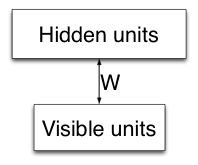
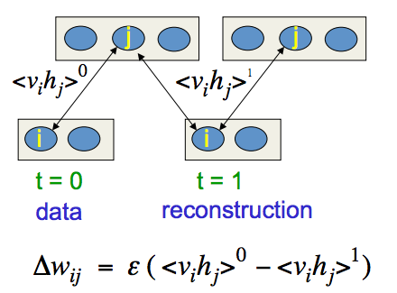

## Programming Assignment 4: Restricted Boltzmann Machines

This assignment is about **Restricted Boltzmann Machines (RBMs)**. We'll first make a few basic functions for dealing with RBMs, and then we'll train an RBM. We'll use it as the visible-to-hidden layer in a network exactly like the one we made in programming assignment 3 (PA3).

For PA3, there was (and still is) a great deal of very good discussion going on, on the forum. Students learned a lot, helped others a lot, figured things out together, and provided valuable feedback. I want to thank everybody who participated in that discussion. I would never have been able to respond to every question, comment, and request for clarification on my own, but because of the community of this course, I wasn't alone. I'm looking forward to the community discussion about this assignment.

This assignment is designed to be easier than PA3: for this assignment, you get more feedback and partial marks along the way, in contrast to PA3, where you were only told (by the gradient checker) whether you did everything right or not. However, for those of you who feel like taking on an extra challenge: you'll find that challenge in the last question of this assignment.

### Randomness

RBMs are intrinsically stochastic (random), which presents problems with automated marking: if everybody's randomness comes out differently, then it gets difficult for us to tell whether the result of your simulations is right or wrong. To remedy that situation, I made the random number generator as predictable as possible, hopefully without significantly diminishing its effectiveness. You should not write any code that uses randomness explicitly. If you need to sample the state of binary units, given their probabilities of turning on, then use the function `sample_bernoulli` that I wrote. That's the only randomness that you'll need.

Added on November 14: Whenever `sample_bernoulli` is called (except when a4_main is running), it prints out the size of the matrix that it received. That output provides additional information, making it easier for you to verify that your program is doing the same as the reference solution.

I don't expect that many of you will come up with correct implementations that have different results from my implementation. However, if that does happen, mention it on the discussion board, and we'll discuss it and find a good way forward.

## Part 1: Setting up
Download a4.zip, unzip it in some directory, start Octave, cd to that directory, and issue the command `a4_init`. That loads the data. You always have to run a4_init after starting Octave, before you can use any of the code.

---

### Question 2:

To verify that everything is properly set up, run `a4_main(300, 0, 0, 0)`. What is the validation data classification cross-entropy loss that it reports? Write the answer with at least five digits after the decimal point.

Answer: 2.360736

---

## Part 2: Programming the basics

First, we must establish some conventions for programming RBMs.

To keep things as simple as possible, we don't use biases. Biases do serve a purpose, but they're not entirely necessary. Because we don't use biases, all of our model parameters are in the weights on the connections between the visible units and the hidden units. That nicely simplifies some parts of the program. Here's what our RBM looks like:



We'll store the model parameters in a matrix of size number of hidden units by number of visible units. We'll store gradients in the same format (just like we did in PA3).

Units in an RBM have binary states: they're either on or off. We'll represent those states with the **number 1 for the on state** and the **number 0 for the off state**.

The state of, say, the visible units, for a number of different configurations that we're handling in parallel (typically one configuration per data case that we're working on), will be stored in **a matrix of size number of visible units by number of cases**, a.k.a. configurations that we're dealing with in parallel. Because the state for each unit in each configuration is either 1 or 0, we'll call this a **binary matrix**. When we store not the state of the units but the conditional activation probability P(vi=1|h) of the units, or some other property of every unit in a number of configurations, we do it in **a matrix of the same size**, but of course it won't be binary.

We'll start by writing a number of fairly basic functions related to RBMs. Some of these are independent; others build on previous ones. You can earn marks for each of these functions. For each one, a skeleton implementation is made available to you. Read the comments in that skeleton implementation for important details of what exactly you're asked to implement.

### Question 3:
#### visible_state_to_hidden_probabilities.m

When we have the (binary) state of all visible units in an RBM, the conditional probability for each hidden unit to turn on (conditional on the states of the visible units) can be calculated. Conditional on the state of the visible units, the hidden units are independent of each other, so this is simply a separate computation for each hidden unit. Implement it in the file `visible_state_to_hidden_probabilities.m`.

There's no gradient checker for this assignment, because it's not focused on gradients as much as PA3 is, but here's another way to find out early if you're going in the wrong direction.

I set up a testing RBM, with 256 visible units and 100 hidden units, and some test configurations for that RBM.

After you finish the function visible_state_to_hidden_probabilities, run the command
```
describe_matrix(visible_state_to_hidden_probabilities(test_rbm_w, data_1_case))

```
to see how the function deals with a single case (a single configuration). When I did that, I got this output:
```
Describing a matrix of size 100 by 1. The mean of the elements is 0.447562. The sum of the elements is 44.756160
```
$$p(h_j = 1) = \frac {1} {1 + e^{-(b_j + \displaystyle \sum_{i\in vis} v_i w_{ij})}} $$

thus the code should be something like:
```
function hidden_probability = visible_state_to_hidden_probabilities(rbm_w, visible_state)
% <rbm_w> is a matrix of size <number of hidden units> by <number of visible units>
% <visible_state> is a binary matrix of size <number of visible units> by <number of configurations that we're handling in parallel>.
% The returned value is a matrix of size <number of hidden units> by <number of configurations that we're handling in parallel>.
% This takes in the (binary) states of the visible units, and returns the activation probabilities of the hidden units conditional on those states.
    m_ = rbm_w * visible_state;
    hidden_probability = 1 ./ (1 + e .^ (-m_));
end

```

If you get something very different, then there's probably a bug somewhere. If you get something different and you think that your code is correct, then please mention it on the forum and we'll figure out what's going on.

Let's also test with 10 cases (configurations) in parallel:

```
describe_matrix(visible_state_to_hidden_probabilities(test_rbm_w, data_10_cases))

```
gave me this output:
```
Describing a matrix of size 100 by 10. The mean of the elements is 0.459927. The sum of the elements is 459.927012

```

Now run `describe_matrix(visible_state_to_hidden_probabilities(test_rbm_w, data_37_cases))`, and write down the sum value with at least 2 digits after the decimal point.

Answer: 1724.967611

---
### Question 4:
#### hidden_state_to_visible_probabilities.m

When we have the state of the hidden units in the RBM, we can calculate the conditional probability of each of the visible units turning on, in a very similar way (RBMs are quite **symmetrical**!) Finish file `hidden_state_to_visible_probabilities.m`, and you can again compare to what I got.

`describe_matrix(hidden_state_to_visible_probabilities(test_rbm_w, test_hidden_state_1_case))` gave me this:
```
Describing a matrix of size 256 by 1. The mean of the elements is 0.474996. The sum of the elements is 121.598898

```

`describe_matrix(hidden_state_to_visible_probabilities(test_rbm_w, test_hidden_state_10_case))` gave me this:
```
Describing a matrix of size 256 by 10. The mean of the elements is 0.469464. The sum of the elements is 1201.828527

```

Now run `describe_matrix(hidden_state_to_visible_probabilities(test_rbm_w, test_hidden_state_37_cases))` and report the sum, with at least 2 digits after the decimal point.

Answer: 4391.169583

---

### Question 5:
#### configuration_goodness.m

If we have the (binary) state of all units (both the visibles and the hiddens), i.e. if we have a full configuration, we can calculate the energy of that configuration, or the goodness (which is negative the energy). Implement that in `configuration_goodness.m` (take note of the comments in that file).

`configuration_goodness(test_rbm_w, data_1_case, test_hidden_state_1_case)` gave me
13.540 (using Octave 3.2.4) or 13.5399 (using Matlab R2012a);

`configuration_goodness(test_rbm_w, data_10_cases, test_hidden_state_10_cases)` gave me
-32.961 (using Octave 3.2.4) or -32.9614 (using Matlab R2012a).

Report the result of `configuration_goodness(test_rbm_w, data_37_cases, test_hidden_state_37_cases)`, with at least 3 digits after the decimal point.

Answer: -18.391

---

### Question 6:
#### configuration_goodness_gradient.m

When we get to training an RBM, we want to make some configurations better (give them higher probability) and others worse (give those lower probability). To do that, we need to find out the gradient of the goodness of a configuration: when we change the model parameters (the weights), the goodness of a configuration changes, and we need to know in which direction to change the weights in order to increase the goodness of a configuration.

Implement that in `configuration_goodness_gradient.m` (take note of the comments in that file).

Hint:

$$ - \displaystyle \frac {\partial E}{\partial w_{ij}} = v_i h_j$$

`describe_matrix(configuration_goodness_gradient(data_1_case, test_hidden_state_1_case))` gave me this:
```
Describing a matrix of size 100 by 256. The mean of the elements is 0.159922. The sum of the elements is 4094.000000

```

describe_matrix(configuration_goodness_gradient(data_10_cases, test_hidden_state_10_cases))gave me this:
```
Describing a matrix of size 100 by 256. The mean of the elements is 0.116770. The sum of the elements is 2989.300000

```

Run `describe_matrix(configuration_goodness_gradient(data_37_cases, test_hidden_state_37_cases))`, and report the sum, with at least two digits after the decimal point.

Answer: 3166.216216

---

### Question 7:
#### CD-1 (Contrastive Divergence 1)

Now that we have all those small functions, we're ready for a bigger job. Let's implement the Contrastive Divergence gradient estimator with 1 full Gibbs update, a.k.a. CD-1. CD-1 was introduced in the lecture. If you feel unsure about what it is, or what the details are, I recommend that you review the lectures first, before you try to write it here, in Octave.There are a number of variations of CD-1, all of which are reasonable in their own way. The variation that we're using here is the one where every time after calculating a conditional probability for a unit, we sample a state for the unit from that conditional probability (using the function **sample_bernoulli**), and then we forget about the conditional probability.

There are other variations where we do less sampling, but for now, we're going to do sampling everywhere: we'll sample a binary state for the hidden units conditional on the data; we'll sample a binary state for the visible units conditional on that binary hidden state (this is sometimes called the "reconstruction" for the visible units); and we'll sample a binary state for the hidden units conditional on that binary visible "reconstruction" state. Then we base our gradient estimate on all those sampled binary states. This is not the best strategy, but it is the simplest, so for now we use it.

The conditional probability functions will be useful for the Gibbs update. The configuration goodness gradient function will be useful twice, for CD-1:

* We use it once on the given data and the hidden state that it gives rise to. That gives us the direction of changing the weights that will make the data have greater goodness, which is what we want to achieve.

* We also use it on the "reconstruction" visible state and the hidden state that it gives rise to. That gives us the direction of changing the weights that will make the reconstruction have greater goodness, so we want to go in the opposite direction, because we want to make the reconstruction have less goodness.

This is the first time that we'll be using randomness, and we have to do it carefully, to ensure that your solution does it in the same way as the reference solution. Whenever **sample_bernoulli** is called (except when **a4_main** is running), it prints out the size of the matrix that it received. That output provides additional information, making it easier for you to verify that your program is doing the same as the reference solution. Be sure to have the most recent version of the starter code, because older versions don't have that extra output.

Implement CD-1 in the file `cd1.m`. Vectorize it, i.e. don't use loops, and also otherwise, make sure that the calls to **sample_bernoulli** exactly match the ones that you see below about 1 case and 10 cases.

Hint:



`describe_matrix(cd1(test_rbm_w, data_1_case))` gave me this:
```
sample_bernoulli() was called with a matrix of size 100 by 1. sample_bernoulli() was called with a matrix of size 256 by 1. sample_bernoulli() was called with a matrix of size 100 by 1. Describing a matrix of size 100 by 256. The mean of the elements is -0.160742. The sum of the elements is -4115.000000

```

describe_matrix(cd1(test_rbm_w, data_10_cases))gave me this:
```
sample_bernoulli() was called with a matrix of size 100 by 10. sample_bernoulli() was called with a matrix of size 256 by 10. sample_bernoulli() was called with a matrix of size 100 by 10. Describing a matrix of size 100 by 256. The mean of the elements is -0.185137. The sum of the elements is -4739.500000

```

Run `describe_matrix(cd1(test_rbm_w, data_37_cases))`, and report the sum, with at least two digits after the decimal point.

Answer: -4669.675676

---

### Question 8 :
#### Improving CD-1

If you go through the math (either on your own on with your fellow students on the forum), you'll see that sampling the hidden state that results from the "reconstruction" visible state is useless: it does not change the expected value of the gradient estimate that CD-1 produces; it only increases its variance.

More variance means that we have to use a smaller learning rate, and that means that it'll learn more slowly; in other words, we don't want more variance, especially if it doesn't give us anything pleasant to compensate for that slower learning.

Let's modify the CD-1 implementation to simply no longer do that sampling at the hidden state that results from the "reconstruction" visible state.

Instead of a sampled state, **we'll simply use the conditional probabilities**. Of course, the configuration goodness gradient function expects a binary state, but you've probably already implemented it in such a way that it can gracefully take probabilities instead of binary states. If not, now would be a good time to do that.

After improving the CD-1 implementation that way, running

`describe_matrix(cd1(test_rbm_w, data_1_case))` gives me this:
```
sample_bernoulli() was called with a matrix of size 100 by 1. sample_bernoulli() was called with a matrix of size 256 by 1. Describing a matrix of size 100 by 256. The mean of the elements is -0.164335. The sum of the elements is -4206.981332

```

`describe_matrix(cd1(test_rbm_w, data_10_cases))` gives me this:
```
sample_bernoulli() was called with a matrix of size 100 by 10. sample_bernoulli() was called with a matrix of size 256 by 10. Describing a matrix of size 100 by 256. The mean of the elements is -0.185591. The sum of the elements is -4751.142054

```

Please run `describe_matrix(cd1(test_rbm_w, data_37_cases))` and report the sum, with at least 2 digits after the decimal point.

Answer: -4716.094972

---

### Question 9:
#### Training an RBM on real-valued pixel intensities

We want to train our RBM on the handwritten digit data that we used in PA3, but that presents a problem:

that data is not binary (it's pixel intensities between 0 and 1), but our RBM is designed for binary data.

We'll treat each training data case as a distribution over binary data vectors. A product of independent Bernoulli-distributed random variables, if you like mathematical descriptions. What it means in practice is that every time we have a real-valued data case, we turn it into a binary one by sampling a state for each visible unit, where we treat the real-valued pixel intensity as the probability of the unit turning on.

Let's add this line of code as the new first line of the cd1 function: `visible_data = sample_bernoulli(visible_data)`;

Now we're ready to start training our RBM. (By the way, if that description was a little too brief or unclear to be maximally helpful, then ask on the forum and we'll have a group discussion about it.)

## Part 3: Using the RBM as part of a feedforward network

Here's the plan: we're going to train an RBM (using CD-1), and then we're going to make the weights of that RBM into the weights from the input layer to the hidden layer, in the deterministic feed-forward network that we used for PA3.

We're not going to tell the RBM that that's how it's going to end up being used, but a variety of practical and theoretical findings over the past several years have shown that this is a reasonable thing to do anyway. The lectures explain this in more detail.

This brings up an interesting contrast with PA3. In PA3, we tried to reduce overfitting by **learning less** (early stopping, fewer hidden units, etc). **This approach with the RBM, on the other hand, reduces overfitting by learning more**: the RBM part is being trained unsupervised, so it's working to discover a lot of relevant regularity in the distribution of the input images, and that learning distracts the model from excessively focusing on the digit class labels.

This is much more constructive distraction: instead of early-stopping the model after only a little bit of learning, we instead give the model something much more meaningful to do. In any case, it works great for regularization, as well as training speed (though the advantage in training speed becomes most visible when we use multiple hidden layers, which we're not doing here).

We're using exactly the same data as we did in PA3, so the results will be comparable (but of course the results of PA4 will be better than those of PA3).

In PA3, we did a very careful job of selecting the right number of training iterations, the right number of hidden units, and the right weight decay.

**For PA4, we don't need to do all that**: although it might still help a little, the unsupervised training of the RBM basically provides all the regularization we need. If we select a decent learning rate, that will be plenty. We'll use lots of hidden units, because we're much less worried about overfitting now.

Script `a4_main` trains an RBM using your CD-1 implementation. Then it turns that RBM into the input-to-hidden weight matrix of the NN of PA3, and trains the hidden-to-class layer in basically the same way as we did it in PA3.

Normally one would also want to keep training those input-to-hidden weights using the backpropagation-based learning, i.e. one would use the RBM as initialization and then do exactly what we did in PA3, but it's not absolutely necessary.

I decided not to do that here because then I'd have to either ask you to use your PA3 code, or I'd have to give you the PA3 solution, and lots of students are still working on PA3.

An initial run `a4_main(300, .02, .005, 1000)` should give you an interesting display of what the RBM learns, as well as the classification loss and error rates, like we saw them in PA3. If the validation data classification cross-entropy loss on that run was not 0.322890 (that's what I got) or something very close to that, then you might have a bug in your code and you should address that first. (If you got 0.336870, carefully read over question 8 again.)

Keep the number of hidden units at 300, the learning rate for the RBM at 0.02, and the number of iterations at 1000. Explore what learning rate for the hidden-to-class weights works best, where "best" means best for the validation data classification cross-entropy loss.

Report that learning rate. If your answer is more than 0.5 times what I found with a very extensive search, and less than 2 times what I found, then it will be considered correct for this question.

Tuning lr_classification via validation cross-entropy loss:
0.005 - 0.322890
0.01 - 0.259159
0.05 - 0.202482
0.075 - 0.199097
0.1 - 0.198644
0.125 - 0.199376
0.3 - 0.210653
0.5 - 0.224757

Answer: 0.1

---

### Question 10:

For the settings that you chose in the previous question, report the test set classification error rate, with at least four digits after the decimal point. (Not for the assignment, but simply as an observation: is it better or worse than what you got on PA3?)

---

### Question 11:

Of course, you can do much more.

For example, explore what number of hidden units works best, and you'll see that that number is indeed much larger than it was on PA3.

Or use your PA3 code to properly train the feedforward NN after its RBM initialization.

Or add some more hidden layers.

Or... creatively combine everything else that you're learning in this course, to see how much this RBM-basedunsupervised pre-training can do.

There's only one more question in this assignment, and it's not one that you need to complete in order to get a good mark. This question is worth only 5% of the grade for the assignment, and it's difficult, so it's mostly here for those of you who feel like taking on a challenge.

 Not only is the question more difficult in itself, but also I'm not going to give you any hints or verification methods or anything else, except that I'll tell you this:

 you don't need a lot of computer runtime for answering the question.

 The partition function a.k.a. normalization constant that you see in the formula for the Boltzmann distribution (the probabality of a particular configuration of an RBM), can take a long time to compute. That's because it's a sum of very many numbers: one for each possible configuration. If you have an RBM with only 2 visible units and 1 hidden unit, then those 3 units mean that there are only 8 possible configurations, so then the partition function can easily be computed.

 But with a bigger RBM, you quickly run into runtime problems.

 `a4_init` not only makes `test_rbm_w` and some data sets, but also `small_test_rbm_w`, which has only 10 hidden units (it still has 256 visible units). Calculate the logarithm (base e) of the partition function of that small RBM, and report it with at least two digits after the decimal point.
